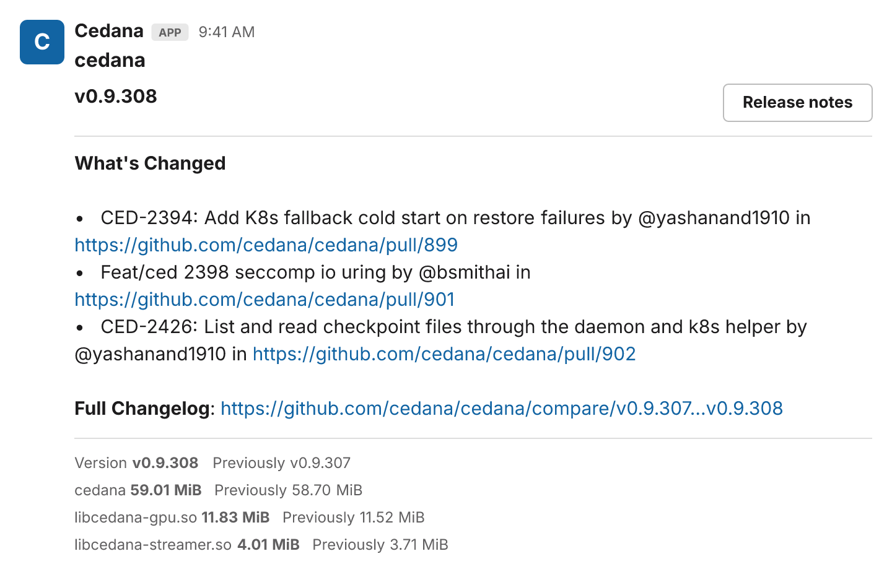

# cedana-publish-summary

GitHub action that posts a release summary to Slack using [Block Kit](https://api.slack.com/block-kit), with GitHub-flavored markdown release notes correctly converted to Slack mrkdwn (via [slackify-markdown](https://github.com/jsarafajr/slackify-markdown)).

The summary includes the release notes, the test matrix of any [cedana-test-summary](https://github.com/cedana/cedana-test-summary) posted earlier in the same workflow run, version comparison with the previous release, and optional binary size comparisons.



*Rendering of the Block Kit payload for a cedana release (not a Slack screenshot), produced by `npm run sample-image`.*

## Usage

Minimal — summarizes the latest non-draft release:

```yaml
- name: Post summary
  uses: cedana/cedana-publish-summary@v1
  with:
    title: cedana
    slack-webhook-url: ${{ secrets.SLACK_WEBHOOK_URL_RELEASE }}
```

With binary size comparison (directories populated by earlier steps):

```yaml
- name: Post summary
  uses: cedana/cedana-publish-summary@v1
  with:
    title: cedana
    tag: ${{ steps.tag.outputs.tag }}
    previous-tag: ${{ steps.previous-tag.outputs.tag }}
    binaries-dir: current
    previous-binaries-dir: previous
    slack-webhook-url: ${{ secrets.SLACK_WEBHOOK_URL_RELEASE }}
```

Multi-version binary layout (e.g. one build per SLURM version, in subdirectories of `binaries-dir`):

```yaml
- name: Post summary
  uses: cedana/cedana-publish-summary@v1
  with:
    title: cedana-slurm
    binaries-dir: current
    previous-binaries-dir: previous
    versions: "23.11 24.05 25.05"
    versions-label: SLURM
    slack-webhook-url: ${{ secrets.SLACK_WEBHOOK_URL_RELEASE }}
```

### Test matrix

When a job earlier in the same workflow run posted a test summary with [cedana-test-summary](https://github.com/cedana/cedana-test-summary), its test matrix image is embedded below the release notes. The test summary leaves its outputs behind as a `test-summary-<title>` artifact of the run, which this action looks up through the runner's own artifact API, so no token or permission is needed; when the run has no such artifact (for example when publishing runs before or without tests), nothing is embedded. Set `test-summary: false` to opt out.

## Inputs

| Input | Description | Default |
| --- | --- | --- |
| `title` | Title of the release summary | Repository name |
| `tag` | Release tag to summarize | Latest non-draft release |
| `previous-tag` | Previous release tag, for comparison | Release preceding `tag` |
| `description` | Markdown description shown under the title | `tag` in bold |
| `release-notes-url` | URL for the release notes button | GitHub release page for `tag` |
| `binaries-dir` | Directory with current release binaries, to report sizes for | — |
| `previous-binaries-dir` | Directory with previous release binaries, to compare against | — |
| `versions` | Space-separated version labels; each is a subdirectory of the binaries dirs | — |
| `versions-label` | Label prefix for each version (e.g. `SLURM` → `SLURM 24.05`) | — |
| `slack-webhook-url` | Slack incoming webhook URL (**required**) | — |
| `github-token` | Token used to read release information | `github.token` |
| `step-summary` | Also write release notes to the GitHub step summary | `true` |
| `test-summary` | Embed the test matrix of the test summaries posted earlier in the run | `true` |
| `dry-run` | Build the payload without posting to Slack | `false` |

## Outputs

| Output | Description |
| --- | --- |
| `payload` | The Slack Block Kit payload that was posted |
| `tag` | The resolved release tag |
| `previous-tag` | The resolved previous release tag |

## Development

```sh
npm install
npm run build   # bundles src/index.js -> dist/index.js (commit dist!)
GITHUB_TOKEN=$(gh auth token) npm run sample-image   # regenerates docs/slack.png from the latest cedana release
```

Test locally against a real repository without posting to Slack:

```sh
GITHUB_REPOSITORY=cedana/cedana \
GITHUB_OUTPUT=/tmp/out GITHUB_STEP_SUMMARY=/tmp/sum \
INPUT_TITLE=cedana \
INPUT_SLACK-WEBHOOK-URL=unused \
INPUT_GITHUB-TOKEN=$(gh auth token) \
INPUT_STEP-SUMMARY=false INPUT_DRY-RUN=true \
node dist/index.js
```
